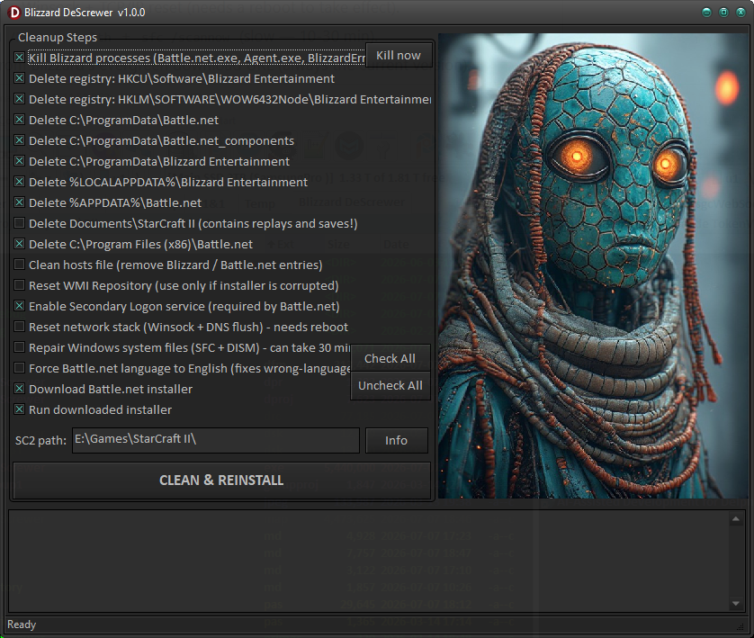

# Blizzard DeScrewer

A small Windows utility that fixes the infamous **Battle.net installer "stuck at 45%"** problem by cleaning out every left-over Blizzard / Battle.net file, folder and registry key, then downloading and running a fresh installer.

Full write-up: [Solution to Battle.net installer stuck at 45%](https://gabrielmoraru.com/solution-to-battle-net-installer-stuck-to-45/)

## Why the installer gets stuck at 45%

At 45% the installer downloads the *Battle.net Update Agent* from Blizzard's CDN. If the Agent hangs — because of a firewall/antivirus, a broken WMI repository, stale network state, or left-over files from a previous install — the progress bar freezes. The usual manual fix is a long checklist of deletions and system tweaks. This tool does that checklist for you, each step being an optional checkbox.

## What it does (each step is optional)

- **Kill Blizzard processes** — `Battle.net.exe`, `Agent.exe`, `BlizzardError.exe`, the setup and update agent.
- **Delete registry keys** — `HKCU` and `HKLM` `Blizzard Entertainment` trees (recursive).
- **Delete left-over folders** — `ProgramData\Battle.net`, `Battle.net_components`, `Blizzard Entertainment`, the per-user `AppData` copies, and `Program Files (x86)\Battle.net`. Everything goes to the Recycle Bin, not a hard delete.
- **Clean the hosts file** — removes stale `Blizzard` / `Battle.net` entries (a backup is saved as `hosts.bak`).
- **Reset the WMI repository** — the Update Agent needs WMI; this salvages/rebuilds it (handles the `0x8007007E` missing-DLL case, and force-stops TinyWall which registers as *not stoppable*).
- **Enable the Secondary Logon service** — Battle.net explicitly requires it.
- **Reset the network stack** — flush DNS + Winsock + TCP/IP reset (needs a reboot to take effect).
- **Repair Windows system files** — `DISM /RestoreHealth` + `sfc /scannow` (slow — 10-30 min).
- **Download & run a fresh installer** — from Blizzard's evergreen download URL (always the current version).

Sensible defaults are pre-checked; the aggressive steps (hosts file, network reset, SFC/DISM) are **off by default** — tick them only if the basic cleanup did not fix the problem.

> **StarCraft II players:** the `Documents\StarCraft II` folder (replays and saved games) is **not** deleted by default. Battle.net does not store game locations in the registry — after a clean reinstall use *Battle.net → StarCraft II → Locate the game* to point it back at your install folder.

## Requirements

- Windows (needs **administrator rights** — the app auto-elevates on start).
- Built with **Delphi** and the [LightSaber](https://github.com/GabrielOnDelphi/Delphi-LightSaber) library. To rebuild from source you need LightSaber on disk; the pre-built `BlizzardDeScrewer.exe` in this repo needs nothing.

## Build

Open `BlizzardDeScrewer.dproj` in Delphi and compile. The project references LightSaber via absolute paths — adjust them to your LightSaber location if needed.

## License

MIT — see [LICENSE](LICENSE). Author: Gabriel Moraru, [gabrielmoraru.com](https://gabrielmoraru.com).
